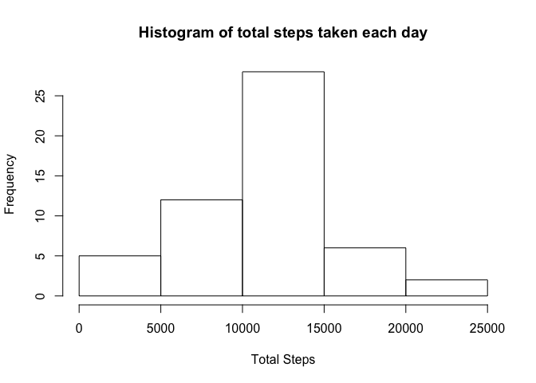
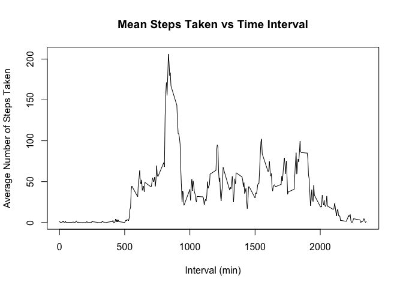
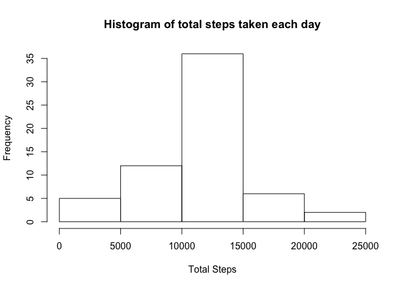
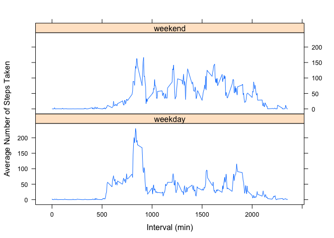

# Reproducible Research: Peer Assessment 1

## Loading and preprocessing the data

```r
actNA <-read.csv("activity.csv")
act <- actNA[complete.cases(actNA),]  #remove NA
```
## What is mean total number of steps taken per day?


```r
totsteps <- act %>% group_by(date) %>% summarise(totsteps = sum(steps))
hist(totsteps$totsteps, main="Histogram of total steps taken each day", xlab="Total Steps")
```

 

```r
mean(totsteps$totsteps)
```

```
## [1] 10766.19
```

```r
median(totsteps$totsteps)
```

```
## [1] 10765
```
## What is the average daily activity pattern?

```r
meansteps <- act %>% group_by(interval) %>% summarise(meansteps = mean(steps))
plot(meansteps$interval,meansteps$meansteps,type="l",main="Mean Steps Taken vs Time Interval",xlab="Interval (min)",ylab="Average Number of Steps Taken")
```

 

```r
meansteps$interval[meansteps$meansteps == max(meansteps$meansteps)]
```

```
## [1] 835
```
## Imputing missing values

```r
sum(is.na(actNA$steps == TRUE))
```

```
## [1] 2304
```
```
Strategy: Replace all NAs with the mean value for the interval averaged over all days calculated previously
```

```r
NAinterval <- actNA$interval[is.na(actNA$steps == TRUE)]
actNA$steps[is.na(actNA$steps) == TRUE] <- meansteps$meansteps[match(meansteps$interval, NAinterval)]
totsteps <- actNA %>% group_by(date) %>% summarise(totsteps = sum(steps))
hist(totsteps$totsteps,main="Histogram of total steps taken each day",xlab="Total Steps")
```

 

```r
mean(totsteps$totsteps)
```

```
## [1] 10766.19
```

```r
median(totsteps$totsteps)
```

```
## [1] 10766.19
```
```
There is no difference in the mean. The median is slightly higher with imputed NA values.
```
## Are there differences in activity patterns between weekdays and weekends?


```r
new <- mutate(actNA, weekdays(as.Date(actNA$date)))
colnames(new) <- c("steps","date","interval","day")
actnew <- new %>% mutate(day = ifelse(day %in% c("Saturday", "Sunday"), "weekend","weekday"))
meanstepsbyday <- actnew %>% group_by(day,interval) %>% summarise(meanstepsbyday = mean(steps))
library(lattice)
xyplot(meanstepsbyday ~ interval | day, meanstepsbyday, type="l",layout=c(1,2),xlab="Interval (min)",ylab="Average Number of Steps Taken")
```

 
